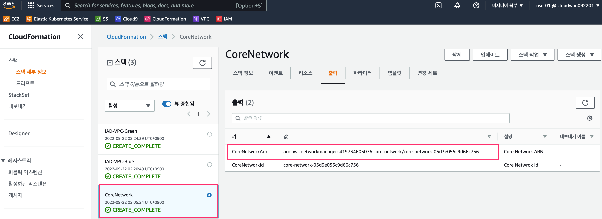

# AWS Cloud WAN

## 소개 

### 작동 방식 

AWS Cloud WAN은 클릭 몇 번으로 글로벌 네트워크를 구축하여 지점, 데이터 센터 및 Amazon Virtual Private Cloud(Amazon VPC)를 연결할 수 있는 중앙 대시보드를 제공합니다. 네트워크 정책을 사용하여 한 위치에서 네트워크 관리 및 보안 작업을 자동화할 수 있습니다. Cloud WAN은 온프레미스 및 AWS 네트워크에 대한 전체 보기를 생성하여 네트워크 상태, 보안 및 성능의 모니터링을 지원합니다.

### 주요 활용 사례 

#### 글로벌 네트워크 구축 

선택한 로컬 네트워크 공급자를 사용하여 AWS에 연결한 다음 AWS 글로벌 네트워크를 사용하여 위치와 VPC를 연결합니다.

#### 클라우드와 온프레미스 환경을 연결 

온프레미스 데이터 센터, 지점 사무실 및 클라우드 리소스를 연결하여 WAN을 클라우드로 확장합니다.

네트워크 시각화 및 제어

단일 위치에서 네트워크를 구성하고 성능 및 상태를 모니터링하며 일상 작업을 자동화합니다.

## 주요 기능

AWS Cloud WAN을 사용하면 데이터 센터와 지사, Amazon Virtual Private Cloud(VPC)를 연결하는 광역 네트워크를 쉽게 구축하고 운영할 수 있습니다. Cloud WAN을 사용하면 선택한 로컬 네트워크 공급자를 통해 AWS에 연결한 다음 중앙 대시보드와 네트워크 정책을 사용하여 위치와 네트워크 유형을 연결하는 통합 네트워크를 생성할 수 있습니다. 따라서 서로 다른 기술을 실행하는 경우에도 서로 다른 네트워크를 개별적으로 구성하고 관리할 필요가 없습니다. Cloud WAN은 온프레미스 및 AWS 네트워크에 대한 전체 보기를 생성하여 전체 네트워크의 상태, 보안 및 성능을 시각화하는 데 도움이 됩니다.

### Central dashboard 

\
중앙 대시보드 Cloud WAN은 지사, 데이터 센터, VPN 연결, 소프트웨어 정의 WAN(SD-WAN), Amazon VPC 및 AWS Transit Gateway를 연결하고 관리하기 위한 중앙 대시보드를 제공합니다. Cloud WAN 대시보드를 사용하면 네트워크 트래픽 및 이벤트를 추적하고 네트워크 상태를 한 곳에서 볼 수 있습니다. 이는 대규모 글로벌 네트워크를 관리하는 운영 복잡성을 줄이고 일상적인 운영을 단순화합니다.

### Centralized policy management 

Cloud WAN을 사용할 때 중앙 집중식 네트워크 정책 문서에서 액세스 제어 및 트래픽 라우팅을 정의합니다. 정책을 업데이트할 때 Cloud WAN은 실수로 인한 오류가 글로벌 네트워크에 영향을 미치지 않도록 , 2단계 프로세스를 사용합니다. 먼저 변경 사항이 프로덕션에서 예상대로 작동하는지 검토하고 검증합니다. 변경 사항이 승인되면 Cloud WAN이 전체 네트워크에 대한 구성 세부 정보를 처리합니다. AWS Management 콘솔 또는 Cloud WAN API를 사용하여 정책 문서를 변경할 수 있습니다.

### Network segmentation 

\
Cloud WAN의 정책을 사용하여 네트워크에 추가하는 AWS 리전 또는 온프레미스 위치의 수에 관계없이 네트워크 트래픽을 쉽게 분할할 수 있습니다. 예를 들어 네트워크 트래픽을 회사내의  다른 트래픽과 쉽게 분리하면서 두 세그먼트에 공유 리소스에 대한 액세스 권한을 계속 부여할 수 있습니다. 이렇게 하면 많은 수의 위치와 VPC를 연결할 때, 특히 고유한 보안 및 라우팅 요구 사항이 있는 대규모 그룹에 정책을 적용해야 하는 경우 일관된 보안 정책을 쉽게 보장할 수 있습니다. Cloud WAN은 사용자를 대신하여 AWS 리전 전체에서 일관된 구성을 유지합니다.

### Built-in automation 

Cloud WAN은 새 VPC 및 네트워크 연결을 네트워크에 자동으로 연결할 수 있으므로 각 변경 사항을 수동으로 승인할 필요가 없으므로 증가하는 네트워크 관리와 관련된 운영 오버헤드가 줄어듭니다. 첨부 파일에 태그를 지정하고 특정 태그가 있는 첨부 파일을 특정 네트워크 세그먼트에 자동으로 매핑하는 네트워크 정책을 정의하여 이를 수행합니다. 이 태그 지정 구조를 사용하면 자동으로 세그먼트에 연결할 수 있는 첨부 파일, 수동 승인이 필요한 세그먼트, 동일한 세그먼트의 첨부 파일이 서로 통신할 수 있는지 여부를 선택할 수 있습니다. 이 모든 것은 선택한 태그를 기반으로 합니다.\

\

\

\
\

